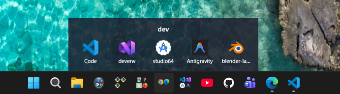
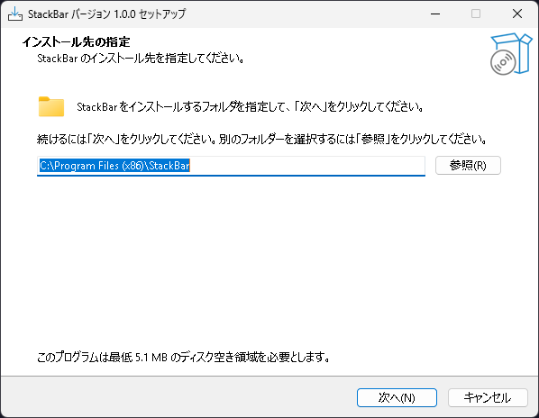
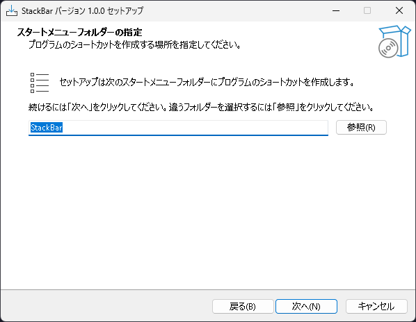
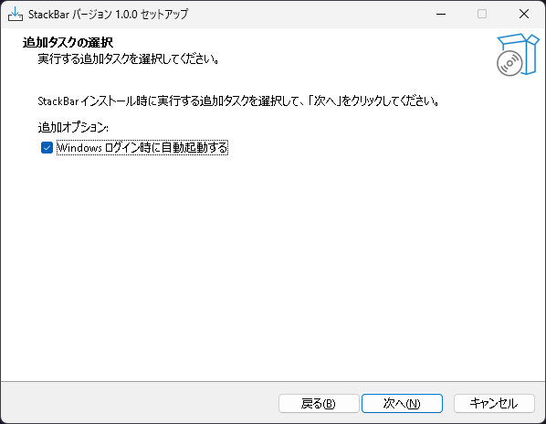
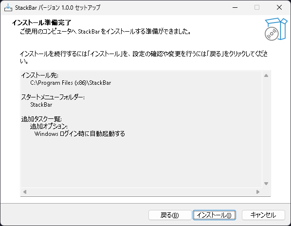
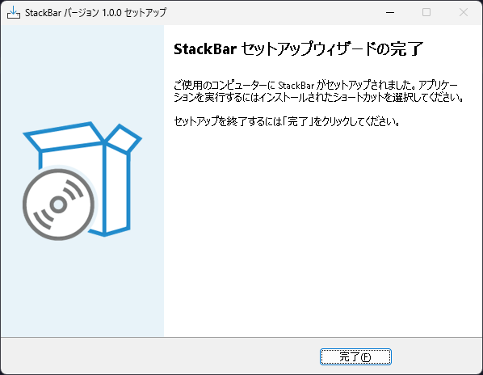
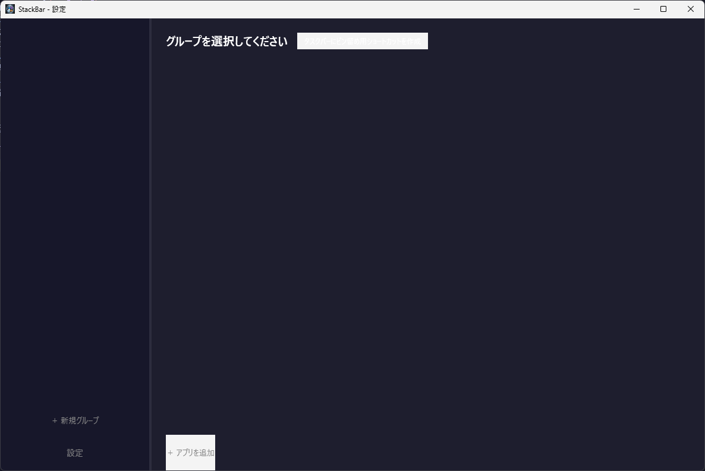
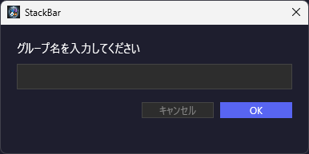
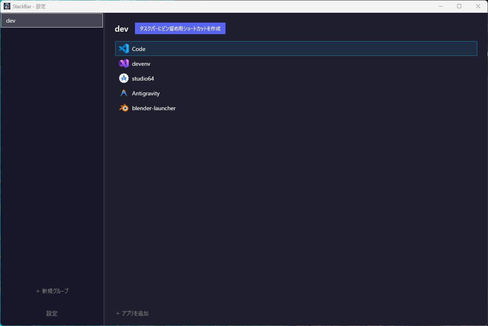

# StackBar 使い方ガイド
- タスクバーグループ化アプリ。

---

## 📥 インストール

### 1. インストーラーをダウンロードして起動する

`StackBar_Setup_1.0.0.exe` をダブルクリックして起動する。

> ⚠️ 「WindowsによってPCが保護されました」という画面が出た場合は、**「詳細情報」→「実行」** をクリックしてください。

---

### 2. インストール先フォルダを決める

デフォルトのままで問題ない。そのまま **「次へ」** をクリック。



---

### 3. スタートメニューのフォルダ名を決める

デフォルトのままで問題ない。そのまま **「次へ」** をクリック。



---

### 4. 自動起動の設定

**「Windows ログイン時に自動起動する」にチェックをつけて「次へ」** をクリック。

> ℹ️ チェックをつけないと、PC起動後に初めてグループを開くとき、バックグラウンドでアプリが起動するまでポップアップ表示にタイムラグが生じます。チェックをつけることを推奨します。



---

### 5. インストール

内容を確認して **「インストール」** をクリック。



---

### 6. 完了

**「完了」** をクリックしてウィザードを閉じる。



> ℹ️ インストール後はPCを再起動することを推奨します。再起動しなくてもスタートメニューからアプリを起動できます。


---

## 🚀 初期設定

### 1. アプリを起動する

スタートメニューから **「StackBar」** をクリックして起動する。



---

### 2. グループを作成する

画面左下の **「新規作成」** からグループを作る。


グループ名を入力して **「OK」** をクリックすると、画面左側の一覧に表示される。



---

### 3. グループにアプリを追加する

追加したいアプリのショートカットをあらかじめデスクトップに置いておくと作業しやすい。

<video controls src="20260409-1430-11.6442150.mp4" title="Title" width="65%"></video>

左のグループ一覧からグループを選択し、デスクトップのショートカットを右側のエリアへ**ドラッグ＆ドロップ**するとアプリが追加される。



---

### 4. タスクバーにピン留めする

画面上部の **「タスクバーにピン留め用ショートカット作成」** をクリックすると、デスクトップにショートカットが作成される。


デスクトップに作成されたショートカットをタスクバーへ**ドラッグ＆ドロップ**してピン留めしたら完成！

---

## ⚙️ アプリの管理

### 別のグループにアプリを移動する

移動したいアプリを**右クリック → 「移動」** を選択する。


移動先のグループを選択する。


移動完了。


---

### グループからアプリを削除する

削除したいアプリを**右クリック → 「削除」** を選択する。

---

### グループを削除する

グループ内のアプリをすべて削除してから、グループの削除ボタンをクリックする。

> ⚠️ アプリが1つでも残っている状態ではグループを削除できません。

---

## 🗑️ アンインストール

スタートメニューから **「StackBar」を右クリック → 「アンインストール」** を選択する。

> ⚠️ アンインストーラーで完全には削除されない場合があります。完全に削除したい場合は以下のフォルダを手動で削除してください。

```
C:\Program Files (x86)\StackBar
C:\Users\ユーザー名\AppData\Roaming\StackBar
```

## 今後の改善。
- アプリのデザインを改善 もっと視覚的にわかるようにする。UIなどの改善。
- 設定画面の追加。
- ポップアップの起動スピードさらに速く。
- 追加できるアプリの数を増やす。今はexeやlnkしか無理だけど、いつかappなどなんでも追加できるようにする予定。
- バックグラウンドで常に動いているため最適化が重要になると思う多分。
- 動作バグがたまにある。前会ったんだけど最近なくてなんであったのかがわからない。
- あとなんだろう。。。なんかあったら教えてください。